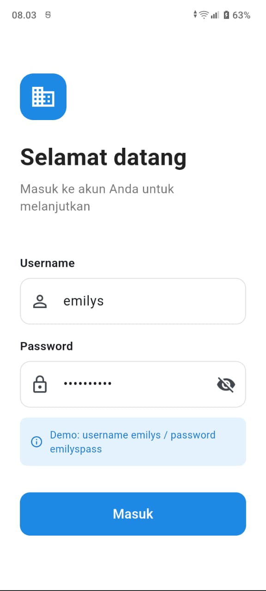
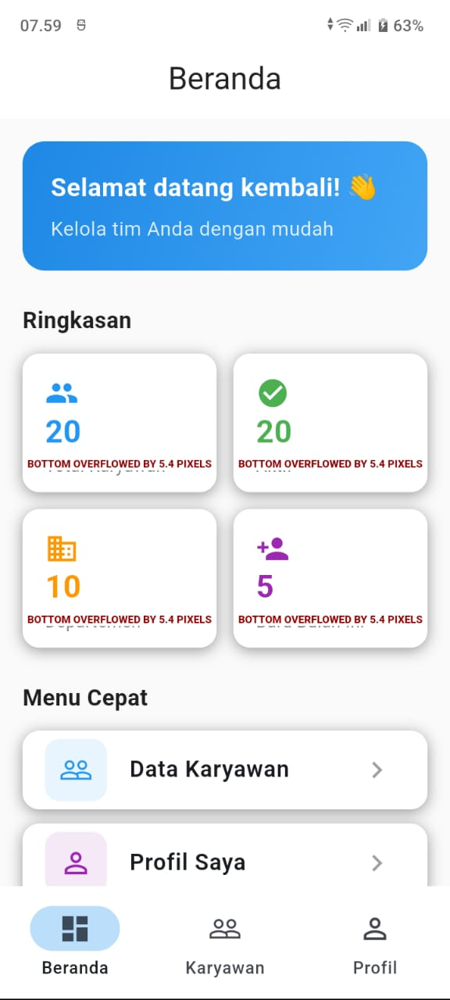
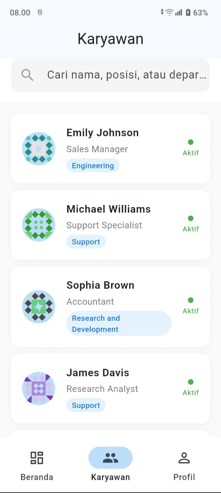
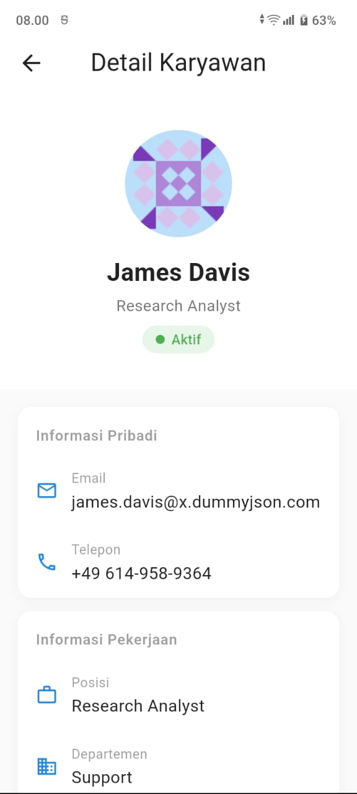
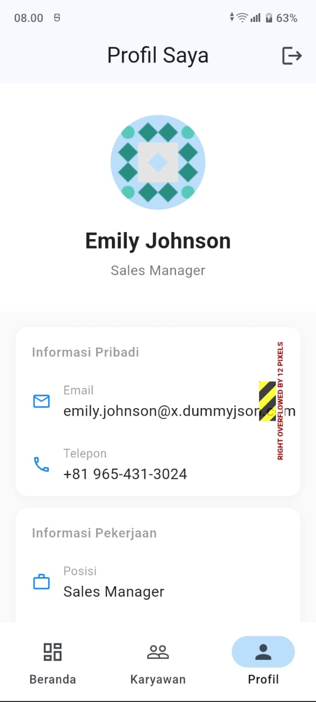

# Flutter BLoC Playground 🚀

Aplikasi manajemen karyawan yang dibangun dengan Flutter menggunakan Clean Architecture dan BLoC pattern sebagai state management.

---

## 📱 Screenshots

| Login | Beranda | Karyawan |
|-------|---------|----------|
|  |  |  |

| Detail Karyawan | Profil |
|-----------------|--------|
|  |  |

---

## 🏗️ Arsitektur

Project ini menggunakan **Clean Architecture** dengan 3 layer utama:
lib/
├── core/                     # Core utilities & shared components
│   ├── bloc/                 # BLoC observer
│   ├── config/               # App configuration & flavor
│   ├── constants/            # App constants & keys
│   ├── error/                # Failure & exception handling
│   ├── injection/            # Dependency injection (GetIt)
│   ├── navigation/           # GoRouter & navigation service
│   └── network/              # Dio & interceptors
│
├── src/                      # Feature modules
│   ├── auth/                 # Authentication
│   │   ├── data/             # Models, datasources, repository impl
│   │   ├── domain/           # Entities, repository interface, usecases
│   │   └── presentation/     # BLoC, pages, widgets
│   │
│   ├── employee/             # Employee management
│   │   ├── data/
│   │   ├── domain/
│   │   └── presentation/
│   │
│   └── profile/              # User profile
│       ├── data/
│       ├── domain/
│       └── presentation/
│
└── component/                # Reusable UI components
└── widgets/

---

## 🛠️ Tech Stack

| Kategori | Library |
|----------|---------|
| **State Management** | flutter_bloc |
| **Dependency Injection** | get_it |
| **Navigation** | go_router |
| **HTTP Client** | dio |
| **Local Cache** | hive_ce |
| **Secure Storage** | flutter_secure_storage |
| **Error Handling** | dartz (Either) |
| **Code Generation** | freezed, json_serializable |
| **Image Cache** | cached_network_image |
| **Loading** | shimmer, loader_overlay |
| **Crash Monitoring** | Firebase Crashlytics |
| **Testing** | flutter_test, bloc_test, mocktail |

---

## ✨ Fitur

- 🔐 **Authentication** — Login & logout dengan JWT token
- 👥 **Daftar Karyawan** — List karyawan dengan pagination & search
- 👤 **Detail Karyawan** — Informasi lengkap karyawan
- 📊 **Dashboard** — Ringkasan data karyawan
- 🌐 **Offline Support** — Data tersedia tanpa koneksi internet
- 💫 **Shimmer Loading** — Loading skeleton yang smooth
- 🔄 **Pull to Refresh** — Refresh data dengan gesture
- 📱 **Responsive** — Support berbagai ukuran layar

---

## 🧪 Testing

Project ini memiliki 3 jenis test:
Unit Test      → Logic & repository testing
Widget Test    → UI component testing
Integration Test → Full flow testing (login → navigasi → logout)

Jalankan semua test:

bash
flutter test

Jalankan integration test:

bash
flutter test integration_test/app_test.dart

---

## 🚀 Cara Menjalankan

### Prerequisites
- Flutter SDK >= 3.0.0
- Dart SDK >= 3.0.0
- Android Studio / VS Code

### Instalasi

bash
# Clone repository
git clone https://github.com/fauzan123-sudo/flutter-bloc-playground.git

# Masuk ke folder project
cd flutter-bloc-playground

# Install dependencies
flutter pub get

# Generate kode (freezed, json_serializable)
dart run build_runner build --delete-conflicting-outputs

# Jalankan aplikasi
flutter run

### Build APK

bash
# Build APK release
flutter build apk --split-per-abi --release

---

## 🌐 API

Project ini menggunakan [DummyJSON](https://dummyjson.com) sebagai API:

| Endpoint | Keterangan |
|----------|------------|
| `POST /auth/login` | Login |
| `POST /auth/refresh` | Refresh token |
| `GET /users` | Daftar karyawan |
| `GET /users/:id` | Detail karyawan |
| `GET /auth/me` | Profile user |

**Demo credentials:**
---
Username: emilys
Password: emilyspass
## 📁 CI/CD

Project ini menggunakan **GitHub Actions** untuk:
- ✅ Otomatis jalankan `flutter analyze` setiap push
- ✅ Otomatis jalankan `flutter test` setiap push
- ✅ Generate kode dengan `build_runner`

---

## 📊 Monitoring

Project ini menggunakan **Firebase Crashlytics** untuk:
- 🔴 Monitoring crash di production
- 📧 Notifikasi email ketika ada crash baru
- 📍 Lokasi crash yang tepat (file & baris kode)

---

## 👨‍💻 Developer

**Fauzan** — Flutter Developer  
Background: Kotlin/Android Developer

---

## 📄 Lisensi

Project ini dibuat untuk keperluan pembelajaran dan portfolio.